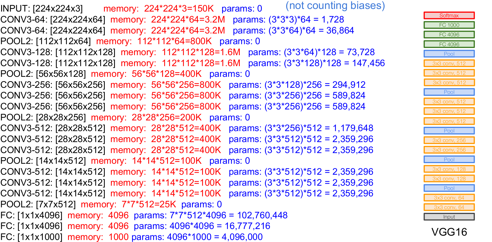

# FCN的整体的结构
- 在论文中，使用的结构框架是VGG16结构,在这里附上cs231n中的结构示意图。

- 在进行转置卷积的时候，我们使用的是SAME模式，但是自己在计算的时候，发现按照和之前卷积一样进行补零等操作的话，得不到结果的输出，所以在转置卷积的过程中，并不是按照常规的按照和卷积一样进行。google了一下转置卷积的具体操作，的到了这样的答案：
- 给出博客的链接：[https://zhuanlan.zhihu.com/p/31988761]
- 文中指出，deconv和conv不同的是，我们需要人为指定反卷积的输出尺寸，这是为了使用value,output_shape和strides三个参数一起确认反卷积尺寸的正确性。在这里strides是非常具有迷惑性的，我们应该理解为只要正向的卷积满足input_size,output_size,stride三个变量之间的设置，反向卷积的时候只要将input_size和output_size进行对调，stride其实还是正向时候的strides，但其实在真正的操作中：
## 反卷积的步长总是等于1的！！！
- 这个操作是真的坑！！！也就是说在进行转置卷积的时候，stride的设置只是一个摆设～文中说的是可以将stride理解为feature map放大的倍数。
- 其实在进行转置卷积之前输出的尺寸就已经确定了，在写代码的时候，只要计算好input_size,output_size,stride在两种padding对应的模式下满足的关系就可以了。
- 但是有一点不明白的是，在进行补零的操作过程中，零并不是补在原始数据两端的，在数据之间也会进行补零的操作。
附上一张补零和反卷积的示意图：！
- 暂且按照上述的方法进行补零的操作吧，但是如果是将输出为1放大到32，这样的操作应该如何进行？再进一步看了转置卷积的操作之后再进行补充说明吧。
